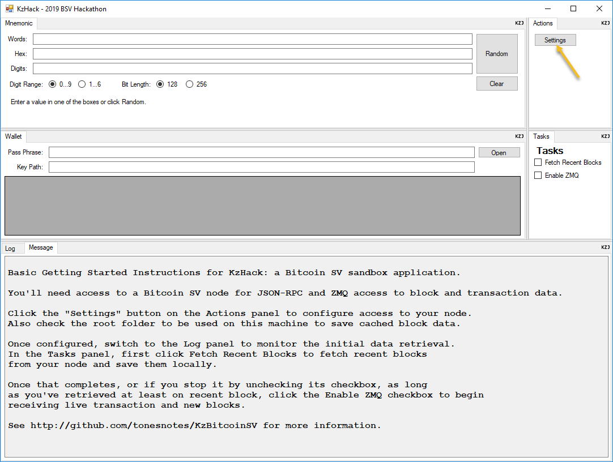
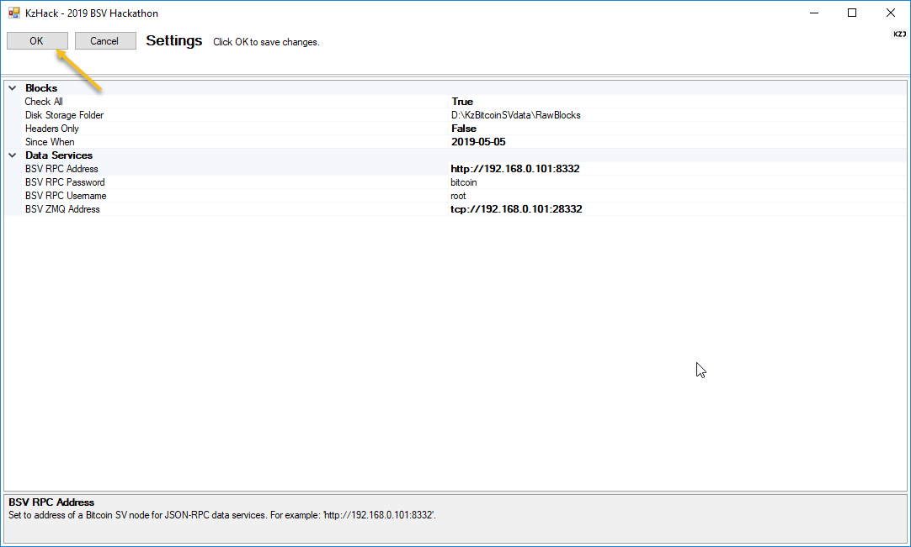
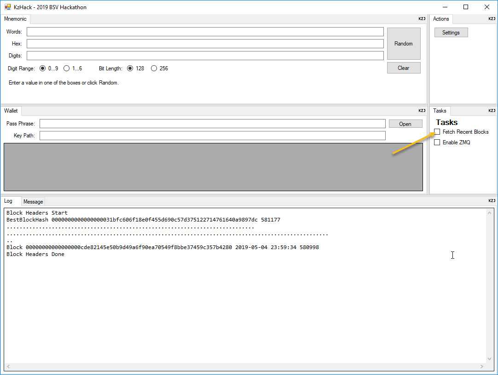
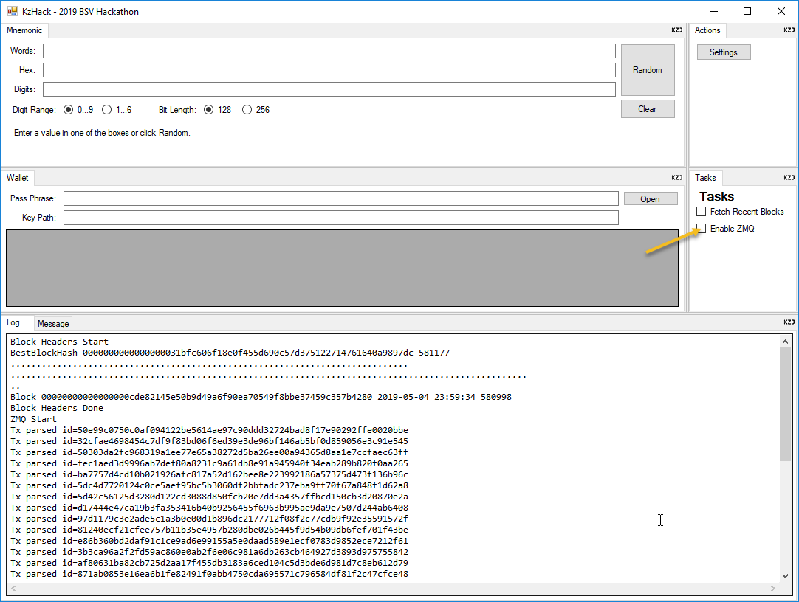
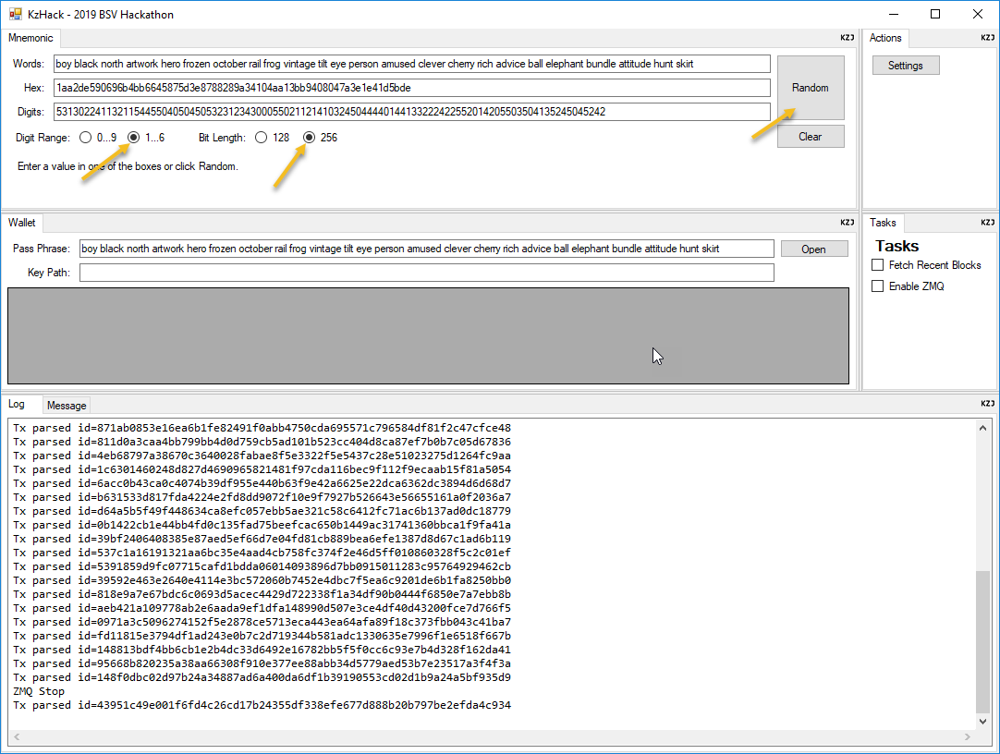

KzjHack
=

KzjHack Implemementation Status
-

* Access to raw Bitcoin SV blockchain data:
  * JSON-RPC is implemented to retrieve blocks from a Bitcoin SV node backwards from the present until a target date.
  * ZMQ is implemented to keep up-to-date on both new blocks and new transactions.
  * Three tiered access to blocks is implemented: In memory, on disk, and RPC fetching.
  * Reorgs and orphans are supported.
* Toy Wallet Support:
  * You can type or import a pass phrase from the Mnemonic panel.
  * The code creates a master HD key from the pass phrase and does some key derivations.
  * Need to add display of funding address and add transaction tracking to compute balance.
* Really want to get to the point of signing and submitting a transaction.
* Wanted to add support for _unwriter protocols. Specifically managing a folder whose contents are synced to the blockchain. Ideally with an expense per hour budget.
* There's no support for safeguarding private keys or pass phrases. Be careful.

Getting Started
--

When you startup the KzjHack application for the first time, hopefully this is what you'll see.

Updating the Settings will let you configure how to access your Bitcoin SV node for RPC and ZMQ access.

Selecting each setting will update the prompt at the botton of the screen.

With the exception of "Check All", all of the settings matter and need to have a correct value.

Here's what my bitcoin.conf looks like:

    datadir=/home/tone/.bitcoin
    dbcache=4000
    # Must set txindex=1 so Bitcoin keeps the full index
    txindex=1

    # [rpc]
    # Accept command line and JSON-RPC commands.
    server=1
    # Default username and password for JSON-RPC connections.
    rpcuser=root
    rpcpassword=bitcoin
    # Heavy RPC use benefits from a higher number.
    rpcworkqueue=512
    # If you want to allow remote JSON-RPC access
    rpcallowip=0.0.0.0/0

    # [ZeroMQ]
    zmqpubhashtx=tcp://192.168.0.101:28332
    zmqpubhashblock=tcp://192.168.0.101:28332
    zmqpubrawtx=tcp://192.168.0.101:28332
    zmqpubrawblock=tcp://192.168.0.101:28332
    zmqpubhashtxhwm=10000
    zmqpubhashblockhwm=100
    zmqpubrawtxhwm=100
    zmqpubrawblockhwm=10

    # [wallet]
    disablewallet=1

    broadcastdelay=42
    maxmempool=6000
    datacarriersize=100000
    limitancestorsize=100000
    limitdescendantsize=100000

With your settings adjusted, verified, and saved, click on the "Fetch Recent Blocks" checkbox in the Tasks panel
to begin retrieving either block headers or full blocks (what you selected) backwards in time from most recent to
the cutoff date you specified.

Each dot on the screen is one block. This may be slow initially if you asked for full blocks because they are being
retrieved and stored to disk. Future runs will find the blocks already on your local disk speeding it up.
Fetching blocks again is fine, it will run much faster because the blocks or headers are now in memory.

For many experiments and applicaitons it isn't necessary to have more than a few days of block history. Be conservative
about your cutoff date until you learn what you need.

Once you've started fetching blocks, you can check the "Enable ZMQ" box to start realtime notification of new transactions and
new blocks from your Bitcoin SV node.

You'll see a line in your Log for each transactions received and each new block added.

The KzMnemonic class is almost fully exercised by the Mnemonic panel in KzjHack. Only support for multiple languages is missing.
Though you can enter a pass phrase in a supported language to see the Hex or Digits.

The Digit Range of 1..6 is there to let you enter your own mostly-true-random bits using a handfull of 6 sided dice.
You'll need 50 or 99 rolls depending on your bit length. You can enter either 0 or 6 for a roll of 6 when entering the
sequence manually. It will always be displayed 0..5 when starting with one of the other values.

The Wallet Panel is just starting to take shape. Clicking Open will grab a pass phrase from the Mnemonic panel and triggers an
event handler in the code currently wired up to some test code for stepping through with the debugger.

Capabilities of the UI
-

The UI framework used by KzjHack supports rapid prototyping. It encourages you to focus on building a collection of UI panels without getting
lost in tweaking all the options at application level design decisions.

In Visual Studio, the MainForm looks really boring: There's a single tabControl with all of the panels on it.

When you first run the application, you'll see an empty window with one lost little "KZJ" icon in the upper right corner. Right click the icon
to display the rapid UI prototyping menu. At the bottom, you'll see a complete list of all your panels. If you select each of them, one at a time,
you'll end up with a single tabControl and all your panels in the order you picked them.

To make something more useful, use the Split Vertical and Split Horizontal to subdivide any existing panel. When you do this you'll get a new KZJ button
in the corner of the new panel. You add your panels into each subdivided panel depending on which KZJ button menu you use. You can also drag panels between
tab controls and hide tab controls (if there's only one tab).

Don't forget to expand the top KZJ menu item and select Save after making changes to your UI layout to make them persist to your next time running the application.

The UI settings are saved in a folder something like C:\Users\Tone\AppData\Roaming\KzjHack\KzjHack\1.0.0 called UiSettings.xml.

Since its easy to change the UI, once you lock it down, copy this file into the KzjHack\Controls folder as the new DefaultUiSettings.xml file.
Any time you delete the UiSettings.xml file, or a new account runs the application, they'll see this new saved UI layout.

Each UI layout has a name and you can switch between them using the KZJ menu. This capability is also used to implement pseudo-modal dialogs.
For example, when you click Settings, the layout is changed to one named "Settings". The first time through, I built the settings "dialog" starting with
what appeared and empty window by doing the following:

1. Add a horizontal splitter.
2. In the upper panel select the OkCancel panel.
3. In the lower panel select the Settings panel (different from the Settings layout on the Layouts submenu).
4. Hide the KZJ button on the lower panel.
5. Hide the tab control on both panels.
6. Adjust the splitter between panels.
7. On the KZJ Layouts menu, select Save to persist these changes.

Adding a New User Control
-

Visual Studio 2019 is only just able to use "Design" mode on WinForms style user interface components used in .NET Core applications.

The way this is done is to create a new project like I've done in the KzjHack.Design project which is a .NET Framework class library instead of .NET Core.

When you need a new user control or need to make changes to existing controls use this ".Design" project. If you forget, you'll get an error when the
designer tries to open your file.

Once you create a new user control in the ".Design" project, save it, cut the control (all files) and paste it into the .NET Core project.

Then go back to the ".Design" project and add the control (all files) as an Existing Item, from the .NET Core project, and choose "As Link" in the
sub-menu off the Save button. This way the same files which actually live with your main project appear in two different projects.
One project is used for design work, the other is where the application actually runs.

The need to do this should go away with the next major update to Visual Studio.

Walkthrough of the Code
-

... this section suffers from the classic do you want to write code or talk about it dilema...

